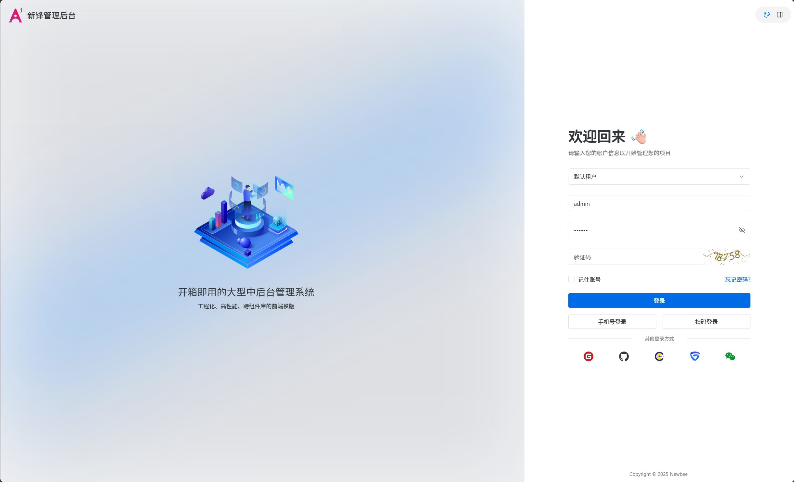
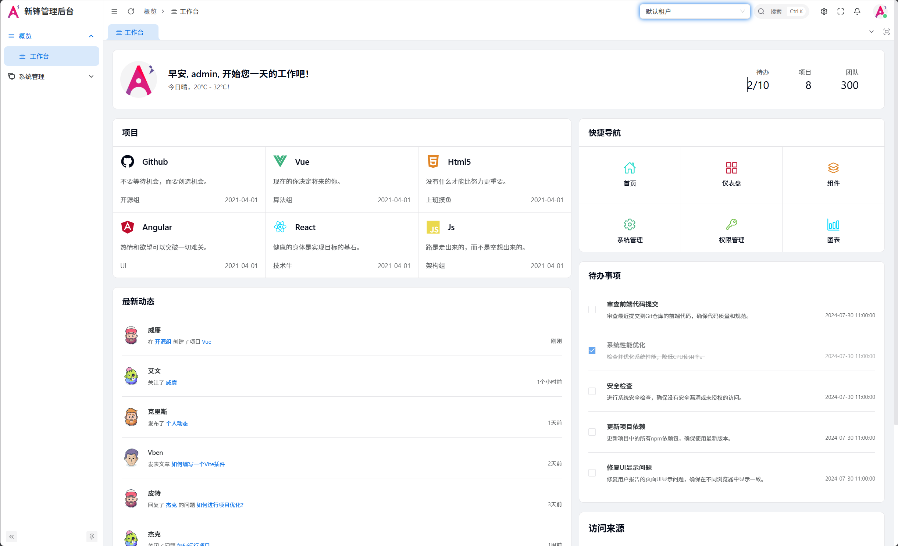
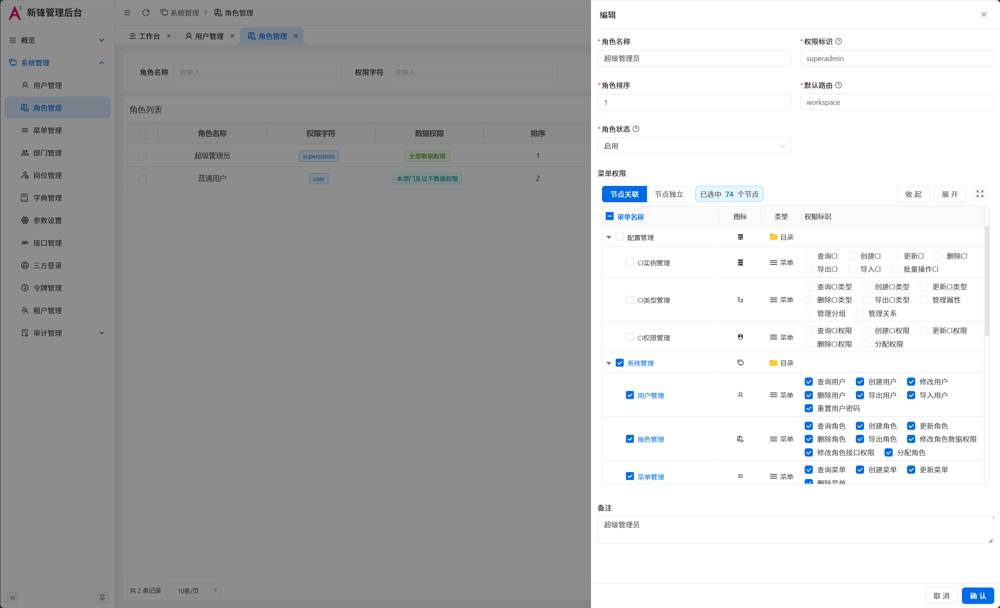
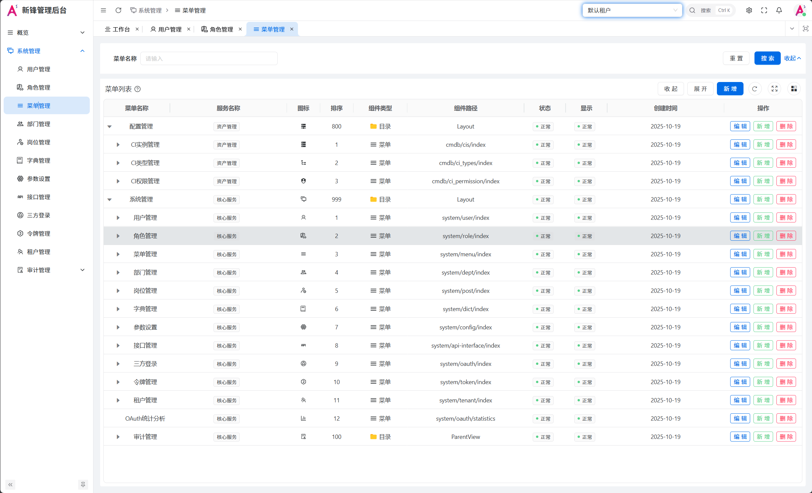
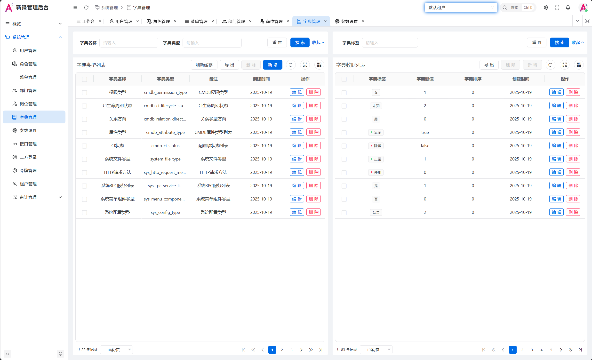
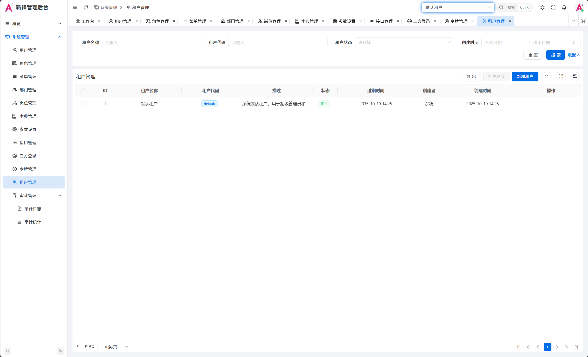
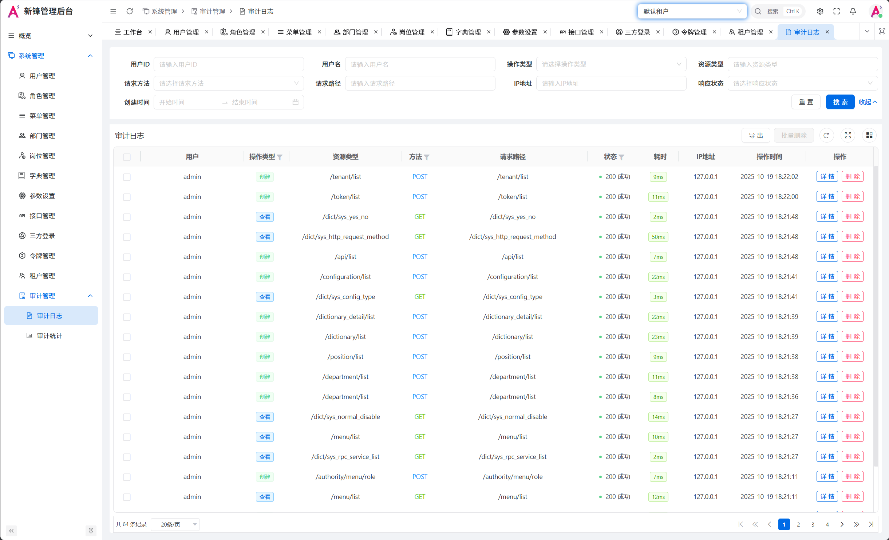
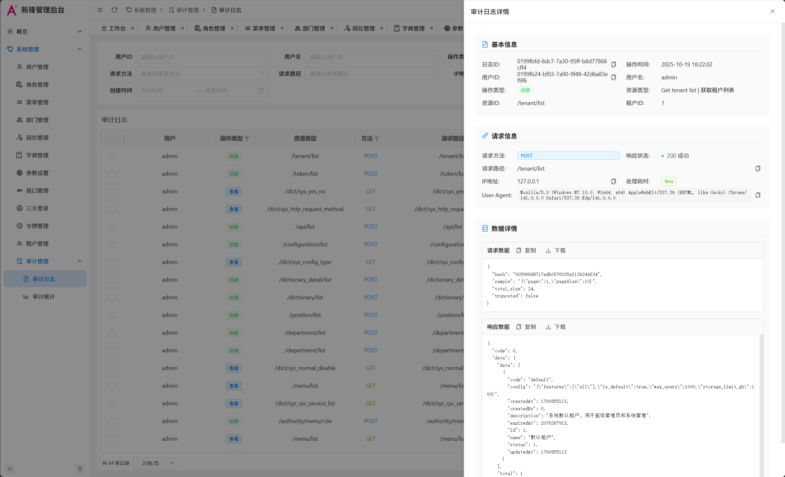
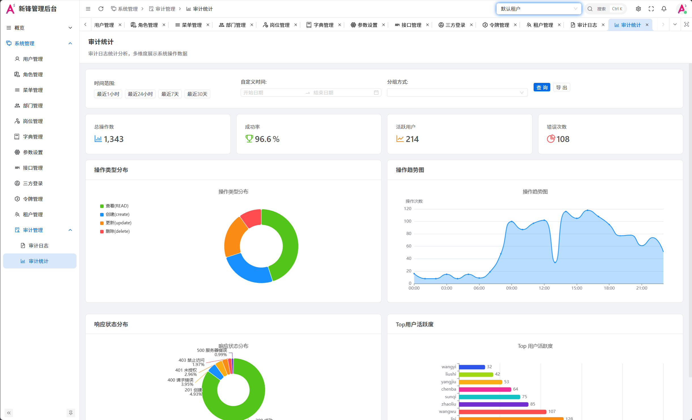

# 新蜂资产管理平台 — 核心服务

新蜂资产管理平台的账号、租户和权限中心，提供用户与组织管理、角色和菜单、API 权限、数据权限、审计日志及 OAuth 接入能力。仓库包含 HTTP API 和 gRPC 两个服务，业务数据由 Ent 管理，公共中间件由 [newbee-common](https://github.com/coder-lulu/newbee-common) 提供。

- [平台工作区与模块清单](https://github.com/coder-lulu/newbee)
- [管理前端与前端部署说明](https://github.com/coder-lulu/newbee-ui)
- [核心服务仓库](https://github.com/coder-lulu/newbee-core)

## 目录与架构

| 路径 | 职责 |
| --- | --- |
| `api/` | HTTP 路由、认证、租户校验、数据权限、审计及 RPC 客户端 |
| `rpc/` | 业务逻辑、Ent Schema、Casbin 策略与 OAuth 服务 |
| `api/etc/core.yaml.example` | API 配置模板 |
| `rpc/etc/core.yaml.example` | RPC 配置模板 |
| `rpc/docs/` | 租户权限、初始化及 OAuth 加密说明 |
| `deploy/` | 从上游保留的 Compose / Kubernetes 部署参考，使用前需要适配 |
| `Makefile` | 构建、测试及代码生成命令 |

请求通过 API 层的统一中间件完成身份、租户和权限校验，再调用 RPC 执行业务操作。RPC 使用统一 Ent Hook 传播租户与部门上下文。核心服务与 CMDB、运维中心、统一 IO 等模块共同组成平台；单独启动核心服务不会启动这些业务模块。

## 环境与源码

以下命令以 Linux / Bash 为例。需要 Git、Go 1.25.1 或更高版本，以及可连接的 MySQL 和 Redis。首次空库初始化还需要 `grpcurl` 命令行工具。Protobuf、goctls、swagger 和 Ent 生成器仅在修改接口或重新生成代码时需要。

推荐克隆完整工作区，因为本仓库 `go.mod` 将 `newbee-common/v2` 替换为相邻的 `../common`，平台还通过根目录 `go.work` 管理其他本地模块：

```bash
git clone --recurse-submodules https://github.com/coder-lulu/newbee.git
cd newbee
# 已经克隆过工作区时补全子模块：
git submodule update --init --recursive
cd core
```

后续源码命令均从 `newbee/core` 执行。依赖下载需要可用的 Go 模块源；不要直接复制上游 Simple Admin 的二进制或数据库替代当前代码。

## 配置数据库与服务

1. 在 MySQL 中预先创建 `newbee` 数据库和专用服务账号，并授予初始化建表与后续业务所需权限。下面的初始化逻辑创建表和基础数据，不负责创建数据库实例。
2. 准备 Redis，API 与 RPC 应连接到一致的实例和逻辑库，以共享缓存、初始化状态和策略通知。
3. 复制模板，修改本地配置：

```bash
cp api/etc/core.yaml.example api/etc/core.yaml
cp rpc/etc/core.yaml.example rpc/etc/core.yaml
```

这两个 `core.yaml` 文件已被 Git 忽略。模板中的内网地址、示例密码和加密参数都需要替换为当前环境值。

| 配置项 | 设置方式 |
| --- | --- |
| 两端 `DatabaseConf` | 配置相同的 MySQL Host、Port、DBName、Username、Password |
| 两端 `RedisConf` | 配置 Host、Pass、Db；未显式指定 Db 时使用默认库 |
| API `CoreRpc.Target` | 单机为 `127.0.0.1:9100`；跨机改为 RPC 的内网地址 |
| RPC `ListenOn` | 单机建议 `127.0.0.1:9100`，跨机按内网监听地址配置 |
| API `Host` / `Port` | 单机反向代理部署建议 `127.0.0.1` / `9101` |
| API `Middleware.auth.accessSecret` | 设置部署环境自己的 JWT 密钥，并与需要校验同一令牌的业务服务保持一致 |
| API `Middleware.encryption` | 首次部署保持前端请求加密关闭，服务端不强制加密；完成客户端解密配置与联调后再启用 |
| RPC `EncryptionKey` | OAuth Provider 凭据的加密密钥；设置独立的 32 字节密钥并持久保存 |
| API `CROSConf.Address` | 按实际前端域名配置；生产环境不要沿用模板的 `*` |
| API `JobRpc` / `McmsRpc` | 模板默认禁用；只有部署对应服务后才启用并设置 Target |
| 两端 `Mode` | 初始化和本地调试可用 `dev`；正式运行设为 `pro` |

模板采用 RPC 直连，基础单机部署不需要 etcd。只有自行改为基于 etcd 的服务发现时才需要部署并配置 etcd。

两端入口均调用 `conf.UseEnv()`，会展开 YAML 中的 `${变量名}`。这不等于任意环境变量都会自动覆盖同名配置。当前模板使用以下变量，请通过运行环境或服务管理器注入真实值：

```text
CORE_API_ETC_CORE_YAML_PASSWORD
CORE_RPC_ETC_CORE_YAML_PASSWORD
CORE_API_ETC_CORE_YAML_ACCESSSECRET
```

其他敏感项也可以在本地 YAML 中改成 `${自定义变量名}` 后注入。两端数据库密码应与数据库账号对应。

## 首次初始化与本地运行

空数据库的启动顺序是 **RPC → 初始化 → API**。API 启动时就会通过 RPC 加载 Casbin 策略，空库直接启动 API 可能因策略表不存在而失败。

首次建表和写入基础数据可能超过模板中的 RPC 超时。初始化前临时将 `rpc/etc/core.yaml` 的 `Timeout` 从 `30000` 调整为 `300000`（毫秒），完成后恢复正常超时并重启 RPC。下方 `grpcurl -max-time 300` 只设置客户端超时，不能覆盖服务端配置。

先在一个终端加载环境变量并启动 RPC：

```bash
go run ./rpc/core.go -f ./rpc/etc/core.yaml
```

在另一个终端、同样从 `core` 目录执行一次初始化：

```bash
grpcurl -plaintext -max-time 300 -import-path ./rpc -proto core.proto \
  -d '{}' 127.0.0.1:9100 core.Core/initDatabase
```

该方法名来自 `rpc/core.proto`，大小写需保持一致。显式传入 proto 无需依赖反射服务。RPC 的初始化接口必须仅在受控内网或本机访问，不能暴露到公网。

初始化会执行 Ent Schema 创建及租户、部门、角色、用户、菜单、API 和权限基础数据写入。建表保留已有列和索引；已有数据库仍应先备份并审查 Schema 差异，正式升级采用经过审查的迁移。

若调用超时，先检查 RPC 日志和数据库状态；初始化代码使用后台上下文，返回超时后写库仍可能继续，不要立即重复执行。确认 RPC 日志和初始化响应成功后，在加载 API 环境变量的终端启动 API：

```bash
go run ./api/core.go -f ./api/etc/core.yaml
```

已运行的 API 也提供 `GET /core/init/database`，受 `ProjectConf.AllowInit` 控制。首次初始化完成后，在 API 配置中显式添加以下配置并重启 API：

```yaml
ProjectConf:
  AllowInit: false
```

该开关只控制 HTTP 初始化入口，不会关闭 RPC 方法，RPC 网络隔离仍然必要。初始化用户由 [初始化代码](rpc/internal/logic/base/init_database_logic.go) 的 `insertUserData` 定义，首次登录后修改初始密码；不要把初始账号用于公开演示环境。

模板端口如下，若调整配置应同时修改调用方和反向代理：

| 服务 | 端口 | 用途 |
| --- | --- | --- |
| Core RPC | 9100 | 内部 gRPC |
| Core API | 9101 | HTTP 业务接口 |
| RPC Prometheus | 4100 | `/metrics` |
| API Prometheus | 4101 | `/metrics` |

```bash
curl --fail http://127.0.0.1:4100/metrics
curl --fail http://127.0.0.1:4101/metrics
```

指标端点可用于确认进程可响应，完整验收还需通过前端检查登录、租户切换、权限及业务查询。当前业务路由未定义 `/core/health`，请勿把该路径作为存活检查。

## Linux 生产部署

### 编译和运行目录

在完整工作区中构建 Linux 二进制（示例为 amd64）：

```bash
mkdir -p bin
CGO_ENABLED=0 GOOS=linux GOARCH=amd64 go build -trimpath -ldflags='-s -w' -o bin/newbee-core-rpc ./rpc/core.go
CGO_ENABLED=0 GOOS=linux GOARCH=amd64 go build -trimpath -ldflags='-s -w' -o bin/newbee-core-api ./api/core.go
```

将二进制安装到 `/opt/newbee/core/bin/`，把准备好的配置安装到 `/etc/newbee/core/rpc.yaml` 和 `/etc/newbee/core/api.yaml`。创建无登录权限的 `newbee` 系统用户，使其可以读取配置并写入所配置的日志目录。配置和环境文件按最小权限管理。

### systemd 示例

下面是部署时创建的示例文件 `/etc/systemd/system/newbee-core-rpc.service`；使用前先完成上面的数据库初始化：

```ini
[Unit]
Description=Newbee Asset Management Platform Core RPC
Wants=network-online.target
After=network-online.target

[Service]
Type=simple
User=newbee
Group=newbee
WorkingDirectory=/opt/newbee/core
EnvironmentFile=/etc/newbee/core/core.env
ExecStart=/opt/newbee/core/bin/newbee-core-rpc -f /etc/newbee/core/rpc.yaml
Restart=on-failure
RestartSec=5

[Install]
WantedBy=multi-user.target
```

另建 `/etc/systemd/system/newbee-core-api.service`，复制上述内容，将 Description 和 ExecStart 改为 API，并在 `[Unit]` 增加 `After=newbee-core-rpc.service`。API 的启动命令为：

```ini
ExecStart=/opt/newbee/core/bin/newbee-core-api -f /etc/newbee/core/api.yaml
```

`/etc/newbee/core/core.env` 使用 `变量名=值` 的 systemd 环境文件格式，填写前述三个变量及本地配置新增的变量；仅授权管理员访问。启动并检查：

```bash
sudo systemctl daemon-reload
sudo systemctl enable --now newbee-core-rpc
sudo systemctl enable --now newbee-core-api
sudo systemctl status newbee-core-rpc newbee-core-api
sudo journalctl -u newbee-core-rpc -u newbee-core-api -n 100 --no-pager
```

systemd 的 `After` 仅保证进程启动顺序，数据库和 RPC 的可用性还要通过日志与业务请求验证。对外入口交给带 HTTPS 的 Nginx，前端 API 前缀与路径转发配置见 [前端部署说明](https://github.com/coder-lulu/newbee-ui)。RPC、数据库、Redis 和指标端口保留在内网。

### 现有 Docker / Kubernetes 文件的适用范围

`deploy/docker-compose/` 和 `deploy/k8s/` 包含从 Simple Admin 保留的历史模板，部分使用 `ryanpower/core-*-docker` 等上游镜像，端口和配置与当前代码不同。它们需要替换为本项目自行构建的镜像并校对配置后才能使用。

当前 Makefile 的 `make docker` 引用根目录 `Dockerfile-api` / `Dockerfile-rpc`，但仓库中没有这两个文件，因此本 README 使用可核对的源码二进制部署方式，不将旧 Compose 描述为当前项目的一键部署入口。

## 开发与相关文档

```bash
go test ./api/... ./rpc/...  # 部分测试需要外部服务，按测试配置准备环境
make gen-api                # 需要 goctls 和 swagger
make gen-rpc                # 需要 Protobuf / goctls 工具链
make gen-ent                # 按 Schema 生成 Ent 代码
```

- [租户 API 权限初始化](rpc/docs/TENANT_API_PERMISSION_INIT.md)
- [数据库初始化与租户 ID 修复说明](rpc/docs/INIT_DATABASE_FIX.md)
- [OAuth Provider 凭据加密](rpc/docs/OAUTH_PROVIDER_ENCRYPTION.md)
- [公共组件与统一中间件](https://github.com/coder-lulu/newbee-common)

本说明依据当前入口、配置模板和初始化代码整理。数据库、Redis、域名和网络条件不同，部署后仍需在目标环境完成业务验收。

## 界面预览

以下为新蜂资产管理平台核心服务配合管理前端的界面示例：

### 系统管理
<div align="center">
  
  <p>用户管理 - 支持用户增删改查、角色分配、密码重置</p>
</div>

<div align="center">
  
  <p>角色管理 - 角色权限配置、数据权限设置</p>
</div>

<div align="center">
  
  <p>部门管理 - 组织架构树形管理</p>
</div>

### 权限控制
<div align="center">
  
  <p>菜单管理 - 动态菜单配置、权限标识</p>
</div>

<div align="center">
  
  <p>API权限 - 接口级权限控制</p>
</div>

### 租户管理
<div align="center">
  
  <p>租户管理 - 多租户SaaS架构支持</p>
</div>

### 监控中心
<div align="center">
  
  <p>在线用户 - 实时监控和强制下线</p>
</div>

<div align="center">
  
  <p>操作日志 - 完整的审计追踪</p>
</div>

<div align="center">
  
  <p>登录日志 - 登录行为监控</p>
</div>

## 上游与许可证

本仓库基于 [Simple Admin Core](https://github.com/suyuan32/simple-admin-core) 开发，遵循与上游一致的 [Apache License 2.0](LICENSE)，保留上游版权与许可证声明。新蜂资产管理平台已调整租户、权限、中间件和数据结构，部署及升级请以本仓库代码和配置为准。第三方依赖与资源遵循各自许可证。
